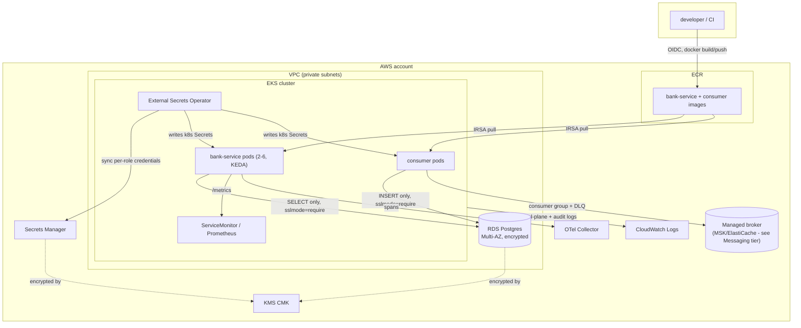

# Decisions

This document explains the reasoning behind the platform in this repo: the
dominant constraint behind each choice, the trade-offs made, and — per the
brief — what was deliberately left undone and why. It assumes the reader has
skimmed [README.md](README.md) for how to actually bring the pieces up and
what was actually run versus authored-only.

## Architecture

The service itself (`service/`) is a thin Go HTTP API plus an event
consumer in front of one Postgres database. Both are intentionally the
least interesting part of this repo - the brief is explicit that the
platform is what's being scored, and the time budget was spent
accordingly.

## SLO and the dominant constraint

The dominant constraint here is what this service actually is: a read path
for account balances in a banking product. A user staring at a failed
balance lookup doesn't shrug it off the way they might a slow product
recommendation - it reads as "is my money okay," and it's a support ticket
either way. That's the thing every other number below is derived from, not
picked in isolation:

- **Availability target: 99.9% success rate over 30 days** (~43 minutes of
  budget). Not 99.99%: this is a single-region deployment with one Multi-AZ
  database and no proven failover runbook (see "What was left out"), and
  promising five nines without having exercised a regional failure would be
  dishonest. 99.9% is what a single-region, Multi-AZ-RDS, multi-replica-EKS
  architecture can actually back up.
- **Latency target: p95 < 300ms, p99 < 500ms** for `GET /api/accounts/{id}`.
  Derived from it being a single indexed primary-key lookup one hop from
  the API - there's no reason for this path to be slow, so the budget is
  tight on purpose; a regression here is a regression, not "normal
  variance."
- These numbers are why the alert thresholds in `observability/alerts.yaml`
  are what they are: `BankServiceHighLatency` fires at p99 > 500ms for 10m
  (the SLO's own boundary), `BankServiceHighErrorRate` fires at 5xx > 5%
  for 5m (deliberately well above the 0.1% error budget - a single
  threshold alert like this is a blunter instrument than a proper
  multi-window burn-rate alert, and 5% is calibrated to page on "this is
  clearly broken" rather than "the 30-day budget is at risk," which a
  burn-rate alert would catch earlier. That's a known simplification, not
  an oversight - see "What was left out").

## AWS mapping

| Local (this repo)                          | AWS equivalent                                  |
|---------------------------------------------|--------------------------------------------------|
| minikube                                    | EKS                                              |
| `docker build` / local image                | ECR (image pushed by CI via OIDC, pulled via node role) |
| Postgres container / `docker-compose.yaml`  | RDS for PostgreSQL (Multi-AZ, encrypted, private subnets) |
| Redis container (event stream)              | Amazon MSK or ElastiCache/MemoryDB - see "Messaging tier" |
| Helm `Secret` templates (`secrets.create`)  | AWS Secrets Manager, one entry per role, synced by External Secrets Operator |
| Plain k8s ServiceAccount                    | IRSA (IAM Roles for Service Accounts) via the EKS OIDC provider |
| stdout trace exporter                       | ADOT (AWS Distro for OpenTelemetry) Collector → X-Ray or a managed Grafana/Tempo backend |
| `kubectl port-forward`                      | AWS Load Balancer Controller + ALB Ingress (see `ingress.enabled` in values-prod-notes.yaml) |
| local disk / stdout logs                    | CloudWatch Logs (control plane + RDS log exports wired in Terraform) |
| GitHub OIDC → `aws-actions/configure-aws-credentials` | Same in prod - no local equivalent needed, this *is* the AWS mechanism |
| none (dev has no state locking)             | S3 + DynamoDB Terraform backend (commented in `versions.tf`, not applied) |

## Reliability: zero-downtime rollout

This is the first thing the brief says it reads, so here's the full
mechanism, verified live against minikube (`kubectl rollout restart` +
continuous `/readyz` polling stayed 200 throughout - see README):

1. **`maxUnavailable: 0` / `maxSurge: 1`** (`deployment.yaml`) - a new pod
   must be Ready before an old one is torn down. This alone doesn't prevent
   dropped connections; it just guarantees capacity never dips.
2. **Pod marked Terminating** - Kubernetes starts removing it from Service
   Endpoints. This removal has to propagate to every kube-proxy (and every
   ALB target group in prod) before it's fully effective, which is not
   instant.
3. **`preStop` hook runs *before* SIGTERM is sent**, and does nothing but
   sleep (`PRESTOP_SLEEP_SECONDS`, default 5s - see `cmd/api/main.go`'s
   `-preStop` mode). The container keeps serving completely normally
   throughout, giving step 2's propagation time to finish before anything
   about the app's own state changes. Distroless has no `sleep` binary, so
   this had to be a mode of the app binary itself, the same trick used for
   `HEALTHCHECK` (see "Container" below).
4. **Only after `preStop` returns does the kubelet send SIGTERM.** The
   app's signal handler flips `/readyz` to 503 *immediately* and calls
   `http.Server.Shutdown()`, which stops accepting new connections but lets
   in-flight ones finish - this is the literal answer to "how does
   `/readyz` start failing before the pod stops accepting connections":
   they happen from the same handler, in that order, and new connections
   have already mostly stopped arriving because of step 3's delay.
5. **`terminationGracePeriodSeconds: 30`** comfortably covers `preStop`'s
   sleep (5s) plus the app's own shutdown timeout (15s) with margin, so
   kubelet never has to SIGKILL a pod that's still draining.
6. **PodDisruptionBudget** (`minAvailable: 1`) backstops all of this against
   voluntary disruptions unrelated to a rollout (node drain, cluster
   upgrade) - a rollout could complete cleanly and a node drain could still
   take the whole thing down without it.

## Autoscaling metric

Default is **KEDA on `avg(http_requests_in_flight)`**, not CPU
(`values.yaml` `autoscaling.strategy: keda`, `templates/keda-scaledobject.yaml`).
This service is I/O-bound - every request blocks on a Postgres round-trip -
so a pod can be fully saturated (connection pool exhausted, requests
queuing) while sitting at 15% CPU. A CPU-based HPA would scale out *after*
the service has already been degraded for a while, because CPU simply
isn't the thing that's actually full. In-flight request count is a direct
read of "is this pod doing more work than it can keep up with," which is
the real bottleneck here.

A CPU-based HPA (`templates/hpa.yaml`) is kept as a fallback behind
`autoscaling.strategy: hpa`, for clusters without the KEDA operator
installed - documented with its limitation stated up front in the template
itself, not hidden. Both were validated with `helm template`; KEDA's actual
scaling behavior was not load-tested against a live cluster (see "What was
left out") - the operator isn't installed on the minikube instance used for
validation, and standing it up plus generating enough concurrent load to
trigger a scale event was judged not worth the time against everything else
in scope.

## Data tier

### Least-privilege roles

`service/migrations/0003_roles.sql` creates two roles, not one, because the
HTTP API and the event consumer are different trust boundaries with
disjoint data needs:

- **`bank_service_api`**: `SELECT` on `accounts` only. Cannot `INSERT`,
  `UPDATE`, or `DELETE` on `accounts`; cannot touch `processed_events` or
  `audit_log` at all (no grant exists); cannot run any DDL; is not the
  table owner.
- **`bank_service_consumer`**: `SELECT, INSERT` on `processed_events` and
  `INSERT`-only on `audit_log`. Cannot read the audit trail it writes
  (no `SELECT` grant on `audit_log`), cannot `UPDATE`/`DELETE` either table
  - an audit log a service could edit after writing isn't an audit log -
  and has zero access to `accounts`.

This is verified, not just asserted: the migration was applied to a live
Postgres and both roles were exercised directly (see README) -
`bank_service_api` was confirmed to `SELECT` successfully and be denied on
`INSERT`/`DROP TABLE`/reading `audit_log`; `bank_service_consumer` was
confirmed denied on reading `accounts` and on `DELETE FROM audit_log`. The
unit test suite includes a DB-backed test (`internal/events/consumer_test.go`)
that runs the actual consumer code against the real `bank_service_consumer`
role in CI - an earlier version of that test tried to clean up with
`DELETE` and failed with `permission denied`, which is the grant working
correctly against the test, not a bug in the grant.

Neither role is a superuser or the table owner, and the schema's default
`PUBLIC` grants are explicitly revoked (`REVOKE ALL ON SCHEMA public FROM
PUBLIC`) so nothing is reachable by accident.

### Credential handling

No plaintext credential is committed. Locally/in the demo chart,
`values.yaml`'s `secrets.*` fields are placeholder passwords used only to
stand up a throwaway minikube/compose Postgres - `values-prod-notes.yaml`
sets `secrets.create: false` for anything resembling production. In that
mode, three separate Secrets Manager entries (admin/migration, API, consumer
- `infra/terraform/modules/secrets`) are synced into the cluster by
External Secrets Operator as three separate native `Secret` objects, each
readable only by the matching pod's IRSA role
(`infra/terraform/modules/iam`'s `irsa` role can `GetSecretValue` on
exactly one ARN). The credential path is: **Secrets Manager entry → ESO
ExternalSecret CR → native k8s Secret → `envFrom` on the one Deployment
that needs it** - never Helm values, never a ConfigMap, never a CI secret.
The migration Job is the only workload that ever holds the RDS master
credential, and only for the duration of the pre-install/pre-upgrade hook.

### Connection pooling

Not fronting Postgres with PgBouncer for this deployment. `pgxpool` already
gives per-pod connection pooling, and at KEDA's configured max of 6 API
replicas plus a handful of consumer replicas, total connection count stays
well within a `db.t4g.micro`'s limit (100 by default) even without an
external pooler. The trade-off: this doesn't hold at higher replica counts
or with more services sharing the database, where RDS's connection ceiling
becomes the actual constraint regardless of per-pod pooling. At that point
I'd add **RDS Proxy in transaction-pooling mode** ahead of both roles - not
session mode, since neither role uses session-level state (advisory locks,
temp tables, `SET` variables) that transaction pooling would break, and
transaction mode gives the highest effective connection multiplexing. This
is a capacity decision I'd rather make with real connection-count data than
guess at here.

### Backup and restore

RDS automated backups, 7-day retention, `storage_encrypted` with the shared
CMK (`infra/terraform/modules/rds`). This implies a **PITR-derived RPO of
~5 minutes** (RDS PITR replays the transaction log continuously, so recovery
point is bounded by replication lag, not the once-a-day snapshot window).
Restore path for a bad deploy or bad data: `aws rds restore-db-instance-to-point-in-time`
to a new instance, verify against a read query, cut the app over via the
Terraform-managed endpoint/Secrets Manager entry, decommission the old
instance. **This has not been tested** - no RDS exists to test it against in
this exercise - so this is recovery *reasoning*, not a proven recovery
path, and I want to be explicit about that gap rather than imply otherwise.
`multi_az` and `deletion_protection` are both wired as Terraform variables,
defaulted off for the dev environment (cost/speed) and meant to be flipped
on for anything resembling production - see `terraform.tfvars.example`.
Multi-AZ protects against an AZ failure with near-zero RTO (automatic
failover); it is not a backup and doesn't change the RPO story above, which
is about point-in-time recovery from bad data or a bad deploy, not
infrastructure failure.

## Messaging tier

### Choice: Redis Streams

Chosen over Kafka, SQS, or NATS JetStream for this exercise specifically
because the brief says not to over-invest in the broker itself - a single
`redis:7-alpine` container is the least operational overhead of the
options while still natively providing everything an idempotent consumer
needs: consumer groups (`XREADGROUP`), a per-message delivery counter and
pending-entries list (`XPENDING`) with no extra bookkeeping table required,
and message reclaim (`XCLAIM`/`XAUTOCLAIM`) for crash recovery. Kafka would
be the right call at real scale (partition-level ordering, log compaction,
long retention as a system-of-record) but its operational cost (ZooKeeper
or KRaft, partition planning) isn't justified by one consumer group doing
audit logging. In AWS, this maps to Amazon MSK (if the workload grows into
needing Kafka's guarantees) or ElastiCache/MemoryDB for Redis (if Streams'
semantics stay sufficient) - see the AWS mapping table.

### Idempotency

`internal/events/consumer.go`'s `handle()` does the dedupe check and the
side-effect write in **one Postgres transaction**:
`INSERT INTO processed_events (event_id) VALUES ($1) ON CONFLICT DO NOTHING`,
and only if that insert actually happened (`RowsAffected() == 1`) does it
insert the `audit_log` row, then commits both together. A crash between the
two is impossible because they're the same transaction - a redelivered
`event_id` hits `ON CONFLICT DO NOTHING`, the audit insert never runs a
second time, and the message still gets ACKed. This was verified live, not
just reasoned about: the same event was published to the stream twice
(`XADD` with the same `id` field twice), and `audit_log`/`processed_events`
both ended up with exactly one row for it (see README). `internal/events/consumer_test.go`
also runs this as an automated test in CI, executed under the real
least-privilege `bank_service_consumer` role.

### Poison messages: retry vs. park

Two distinct failure modes, handled differently:

- **Unparseable messages** (missing/invalid `data` field, missing `id`) are
  dead-lettered *immediately*, no retry - no amount of redelivery fixes a
  malformed payload, so retrying it would just waste a retry slot a
  transiently-failing-but-fixable message could use.
- **Messages that fail processing** (e.g. a DB error) are left un-ACKed and
  picked up by `reclaimStale`, which runs every 10s: anything idle past
  `minIdle` (30s) is either reclaimed for another attempt (delivery count
  ≤ `maxDeliveries`, default 5) or dead-lettered (delivery count exceeded).
  Redis's own per-message delivery counter (returned by `XPENDING`) is what
  `RetryCount` is checked against - no separate attempt-tracking table
  needed.

Dead-lettered messages go to a `<stream>.dlq` Redis Stream carrying the
original fields plus `dlq_reason` and `dlq_original_id`, and are ACKed off
the main stream so they stop occupying a pending slot. This was verified
live: a message missing its `id` field was published, confirmed
dead-lettered within the log output, and confirmed present on
`bank.events.dlq` with the correct reason string, while `XPENDING` on the
main stream returned to zero (see README). What retrying the DLQ back into
the main stream looks like (a human or a scheduled job replaying it after a
fix ships) is not automated - a poison-message DLQ that auto-retries into
the same stream forever isn't actually a DLQ.

## Container and supply chain

Multi-stage Dockerfile (`service/Dockerfile`), both final stages built
`FROM gcr.io/distroless/static-debian12:nonroot` pinned by digest (not just
tag) with the Go builder stage (`golang:1.25-bookworm`) also pinned by
digest. `CGO_ENABLED=0` gives a fully static binary (pgx is pure Go, no
libpq needed), which is what lets the final image be distroless at all - no
shell, no package manager, nothing for an attacker with code execution to
pivot with. Runs as the distroless `nonroot` numeric UID (65532), with
`readOnlyRootFilesystem: true` and all Linux capabilities dropped at the
Kubernetes `securityContext` level (`deployment.yaml`) - the app never
writes to disk, so read-only root is free correctness, not a constraint
worked around.

**`HEALTHCHECK`** was the one place distroless's lack of a shell required a
workaround: `HEALTHCHECK CMD` normally shells out to `curl`/`wget`, neither
of which exist in this image. Instead the binary has a `-healthcheck` mode
(`cmd/api/main.go`) that does a loopback HTTP GET to its own `/healthz` and
exits 0/1 - `HEALTHCHECK`'s JSON exec-form CMD calls the binary directly, no
shell involved. The same pattern is reused for the `preStop` hook's sleep
(`-preStop`, see "Zero-downtime rollout" above), since distroless has no
`sleep` binary either. Both were verified live: `docker ps` showed the
container transition from `health: starting` to `(healthy)` using exactly
this mechanism (see README).

Two separate minimal final images (`api` and `consumer` build targets) share
one pinned base and one builder stage, so the consumer's image never
contains the HTTP server binary and vice versa - smaller attack surface per
workload than one combined image would have.

CI (`ci.yaml`) builds and Trivy-scans both images on every PR
(`severity: CRITICAL,HIGH`, `exit-code: 1`), which fails the check and
blocks merge if this check is marked required in branch protection (not
configured in this repo, since there's no GitHub remote yet - documented in
README as a one-time setup step). CD (`cd.yaml`) tags every image
`api-v<run_number>-<short_sha>` / `consumer-v<run_number>-<short_sha>` -
never `latest`, and the tag string can't be produced by any other commit.

## CI/CD and deployment strategy

`ci.yaml` runs on every PR: `go vet`, unit tests against a real Postgres
service container with the actual least-privilege roles applied (not
mocked out - the point of both `/readyz` and the consumer's idempotency
guarantee is real DB behavior, so a fake DB would test nothing meaningful
here), `govulncheck`, a Trivy scan per image, `helm lint`/`helm template`
across several value combinations, `terraform fmt`/`validate`/**a real
`terraform plan`**, and a gitleaks secret scan.

Three separate GitHub Actions OIDC roles exist (`infra/terraform/modules/iam`),
each scoped to exactly what its workflow needs and no more - **no static
`AWS_ACCESS_KEY_ID`/`AWS_SECRET_ACCESS_KEY` exists anywhere in this repo or
its GitHub secrets, for any of the three**:

| Role | Trust policy `sub` | Can do | Used by |
|---|---|---|---|
| `ci_deploy` | `repo:<org>/<repo>:ref:refs/heads/main` | Push images to one ECR repo. Nothing else - cannot touch EKS, RDS, or Secrets Manager. | `cd.yaml`, on merge to main |
| `terraform_plan` | `repo:<org>/<repo>:pull_request` | Read-only (`Describe`/`List`/`Get`) across the services this stack touches. Explicitly excludes `secretsmanager:GetSecretValue` - planning needs to know a secret exists, never what's in it. | `ci.yaml`'s `terraform` job, on every PR |
| `terraform_apply` | `repo:<org>/<repo>:environment:terraform-apply` | Full CRUD on the non-IAM services this stack manages (`ec2:*`, `eks:*`, `rds:*`, `kms:*`, `secretsmanager:*`, `ecr:*`, `logs:*`); IAM actions scoped by resource ARN to `${name}-*`-named roles only, plus a `PassRole` restricted the same way and conditioned on `iam:PassedToService`. | `terraform-apply.yaml`, manual dispatch only |

Each role is meaningfully narrower than the one above it, and the *reverse*
is also true on purpose: `ci_deploy` cannot read or change infrastructure,
and `terraform_plan` cannot write anything at all, so a compromised PR
workflow run gets read-only AWS access, not a foothold toward changing
infrastructure. This wasn't the first cut of this repo - the initial
version had a `providers.tf` comment claiming CI authenticated via OIDC for
Terraform operations when no such role or workflow step actually existed;
building the two Terraform-specific roles and wiring a real `terraform
plan` step to use one of them (see below) replaced that inaccurate comment
with something that's actually true.

The **`terraform_apply` role's IAM permissions are the one place this
whole repo grants something close to self-management**, and it's worth
naming the residual risk rather than hiding it: a role that can
`iam:CreateRole` + `iam:AttachRolePolicy` is a privilege-escalation vector
in general, even when scoped by resource ARN to a naming pattern - it could
still create a *new*, differently-named role and attach broad policies to
*that*. The standard closure for this is a permissions boundary policy
applied to every role this pipeline creates, which is **not implemented
here** (see "What was left out"). What *is* implemented: the ARN-pattern
scoping, a narrowly-conditioned `PassRole`, and gating the role behind a
dedicated `terraform-apply` GitHub Environment requiring manual approval,
separate from the `production` app-deploy Environment - so even accepting
the residual IAM risk, nothing can reach that role without a human
approving that specific run first.

The **manual approval gate** is a GitHub Environment - two of them,
actually, kept separate on purpose: `production` gates `cd.yaml`'s app
deploy-PR step, `terraform-apply` gates `terraform-apply.yaml` entirely.
Configuring a required reviewer on each Environment (Settings →
Environments) is what actually blocks either job from proceeding without a
human clicking approve; this is native GitHub functionality, not something
either workflow implements itself. Splitting them means the person (or
team) approving an application rollout isn't automatically also the person
approving an infrastructure change, and a compromised approval on one
can't be used to push through the other.

`cd.yaml` **deliberately does not run `helm upgrade` against a live
cluster.** The deploy step instead documents (and would, in a complete
version, automate) opening a PR that bumps `image.tag`/`image.consumerTag`
in the chart's values to the newly-built version; a human reviews and
merges it, and Argo CD (or Flux) running in-cluster reconciles the change.
I did not stand up Argo CD itself (see "What was left out") - only the
workflow boundary and reasoning are here. The reasoning: I'd rather CI hold
zero cluster-reaching credentials than narrow ones, every production change
gets a merged PR as its audit trail the same way a code change does, and
**rollback has two paths, not one**: `helm rollback bank-service <revision>`
for something that needs to be undone right now (uses Helm's already-
rendered previous manifest, no rebuild), or `git revert` the tag-bump PR as
the path of record, since every rollback should be a merged PR the same as
every rollout was.

## Terraform / IaC

Modules: `network` (VPC/subnets/NAT), `ecr`, `eks` (cluster + managed node
group + OIDC provider for IRSA), `rds` (encrypted Postgres, Multi-AZ/
deletion-protection as variables, pgAudit-lite logging via parameter
group), `iam` (the IRSA role and the three GitHub-OIDC roles described
above), `secrets` (Secrets Manager, KMS-encrypted). One `envs/dev` root
module wires them together.

`terraform fmt`, `terraform init`, and `terraform validate` all pass. A
`for_each` bug (keying a `security_group_rule` by a set of security-group
IDs that are themselves unknown until apply - the freshly-created EKS
cluster SG) was caught and fixed by actually running `terraform plan`
rather than stopping at `validate`, which doesn't catch this class of
issue. `terraform plan`'s sanitised output is committed at
`infra/terraform/envs/dev/plan-output.txt` (46 resources to add, 0 errors,
generated with `-var="enable_github_oidc=true"` so the three OIDC roles and
their exact trust-policy `sub` conditions are actually present in the
committed output, not just described), generated with dummy AWS credentials
(`skip_credentials_validation`/`skip_requesting_account_id`/
`skip_metadata_api_check`, gated behind an `offline_demo` variable and
called out inline in `providers.tf` as existing only so this plan can run
without a real account - see the note in that file distinguishing this from
real CI credentials) and manually checked for account IDs before
committing - there are none, since every resource is a fresh create with no
data source resolving a real account. No `terraform apply` was run,
consistent with the brief; the backend is local for the same reason, with
the intended S3+DynamoDB remote backend documented (commented) in
`versions.tf` - `ci.yaml`'s real `terraform plan` step (via the
`terraform_plan` OIDC role) runs against that same local backend today,
which means its state doesn't persist between CI runs; wiring the S3
backend needs that backend's own bucket/table to exist first, a bootstrap
step out of scope here and called out inline in `ci.yaml`.

## Observability

**RED metrics** via `client_golang` on `/metrics`:
`http_requests_total` (rate, and errors via its `status` label),
`http_request_duration_seconds` (a histogram, so `histogram_quantile` gives
duration at any percentile), plus `db_up` and Go runtime metrics.

**Tracing**: `internal/tracing` wraps the whole HTTP handler in an
`otelhttp` span per request and `internal/db` adds a nested
`db.get_account` child span around the actual Postgres query - a real
two-hop trace path (HTTP → DB), not just a single span. It exports to
stdout as pretty-printed JSON by default (`OTEL_EXPORTER_OTLP_ENDPOINT`
unset), which is what let this be verified live with zero extra
infrastructure: a real request produced a real parent/child span pair with
matching trace IDs and `ChildSpanCount: 1` (see README). Setting
`OTEL_EXPORTER_OTLP_ENDPOINT` (wired through as a Helm value,
`tracing.otlpEndpoint`) switches to OTLP/HTTP export to a real collector -
in AWS, an ADOT Collector forwarding to X-Ray or a managed Tempo/Grafana
backend. The consumer does not have tracing wired in - the brief asks for
"at least one trace path through the service," which the API satisfies;
extending it to the consumer's Redis→Postgres path was scoped out (see
"What was left out").

**Dashboard**: `observability/dashboard.json` is a panel-as-code Grafana
dashboard (three timeseries panels: request rate by route, error rate,
p95 latency on the accounts endpoint), importable directly or via the
ConfigMap/sidecar provisioning pattern. Not stood up against a live
Grafana - authored and JSON-validated only, consistent with the brief's
"documenting the wiring is sufficient" allowance.

**Alert that would actually page**: `BankServiceDatabaseDown`
(`db_up == 0` for 1 minute, `severity: critical`) - chosen as the one to
call out specifically because it's the alert with zero ambiguity about
whether it's real: if the database is unreachable, every request is
failing, readiness is failing, and there's nothing to investigate before
paging. The latency and error-rate alerts have some judgment built into
their thresholds (see "SLO" above); this one doesn't need any.

### PII scrubbing

What's deliberately kept out of telemetry: **span attributes carry
`bank.account_id` (an opaque identifier) but never `owner` name or
`balance_cents`** - the account ID is what you need to correlate a trace
with a support ticket or a log line; the owner's name and their balance are
not needed for that and are exactly the two fields on this table that are
actually sensitive. Structured logs (`slog`) only ever log `id` and error
strings, never scan a whole `db.Account` struct into a log line. Prometheus
metric labels are similarly scoped to `route`/`method`/`status` - never
`account_id`, both because it's not needed for aggregate RED metrics and
because a high-cardinality label like a per-account ID would blow up
Prometheus's cardinality regardless of the PII question.

What this **doesn't** catch, honestly: an account ID is still a stable
identifier that can be correlated with other systems to re-identify a
person even though it isn't a name by itself - "not directly identifying"
isn't the same as "not sensitive," and a sufficiently motivated party with
access to both this system's traces and another system's account-ID-to-
name mapping could re-link them. Error messages returned from the database
driver (`internal/db.go`'s wrapped errors) are logged at `Error` level and
could in principle include query fragments if a future change added
string-interpolated SQL (it doesn't today - all queries are parameterized) -
that's a risk in what the code could become, not what it does now, but it's
the kind of thing field-level scrubbing rules don't catch because they
operate on structured fields, not arbitrary error strings. A proper answer
to both gaps is a log/trace processor with an explicit denylist (block
`owner`, `balance_cents`, raw SQL text) enforced at the collector, not just
"don't add it to structs" as application-level discipline - that processor
is not built here (see "What was left out").

## What I consciously left out, and why

Time-boxed against a large brief; these are cuts, not oversights:

- **No IAM permissions boundary on the `terraform_apply` role.** That role
  can create new IAM roles and attach policies to them (needed - this
  stack's own `iam` module does exactly that), which is a
  privilege-escalation shape even with the ARN-pattern scoping and manual
  approval gate this repo does have (see "CI/CD and deployment strategy").
  The full closure - a permissions boundary policy attached to every role
  this pipeline creates, capping what any role it creates can ever do
  regardless of what policies get attached to it later - isn't implemented.
- **No live Argo CD / GitOps controller.** The CD workflow stops at "open a
  PR that bumps the tag" as a documented boundary rather than a working
  Argo CD install - standing up Argo CD well (repo structure, app-of-apps,
  RBAC) is its own multi-hour task, and a half-configured GitOps tool is
  worse than clearly describing the intended pattern.
- **KEDA's actual scaling behavior was not load-tested.** The ScaledObject
  is authored and `helm template`-validated, but no KEDA operator was
  installed on the validation cluster and no load was generated against
  it - the metric choice is justified by reasoning about the workload, not
  by an observed scale-up event.
- **No managed broker (MSK/ElastiCache) provisioned in Terraform.** The
  messaging tier's AWS mapping is documented, not built as a Terraform
  module, since the exercise's messaging infra is explicitly meant to stay
  minimal (a bare Redis container) and I judged Terraform-izing a broker
  neither this exercise nor a real migration needs yet to be lower value
  than everything else in scope.
- **No DLQ replay tooling.** Dead-lettered messages land on
  `bank.events.dlq` and stay there; replaying them back into the main
  stream after a fix ships is a manual/future operation, not automated.
- **No tracing on the consumer.** Only the HTTP API's request→DB path is
  instrumented; the consumer's Redis→Postgres path isn't, though the same
  `internal/tracing` package would extend to it directly.
- **No PII-scrubbing processor at the collector level.** Field-level
  discipline (never put `owner`/`balance_cents` in a span or log) is
  enforced by code review today, not by an enforced denylist at the
  telemetry pipeline - see "PII scrubbing" above for what that gap actually
  means.
- **Recovery reasoning, not a proven recovery.** The RDS PITR restore path
  is described with its implied RPO, not executed - there's no RDS in this
  exercise to execute it against. Same for the least-privilege roles and
  idempotency, though: those *were* proven against a real (local) Postgres,
  not just reasoned about, and that distinction is intentional throughout
  this document.
- **No Ingress controller / TLS termination wired up locally.** minikube
  has no guaranteed ingress controller; the chart ships an `Ingress`
  template gated behind `ingress.enabled` for the prod overlay, rendered
  and checked with `helm template` but not exercised against a real
  controller.
- **No service mesh, no multi-region/DR runbook, no WAF, no Vault.** Same
  reasoning as before: mTLS/retries/circuit-breaking for one service
  talking to one database is covered by NetworkPolicy + TLS-to-RDS without
  a mesh's operational cost; multi-region is a project of its own, not a
  checkbox; WAF sits in front of an ALB this exercise doesn't stand up;
  Secrets Manager + IRSA covers the same need as Vault with less
  operational surface for a single-cloud, EKS-only setup.
- **Terraform stops at `plan`.** Per the brief - no AWS account, no
  `apply`. The `offline_demo` provider flags exist purely so `terraform
  plan` runs without real credentials in this environment and are called
  out inline as something a real environment removes.
